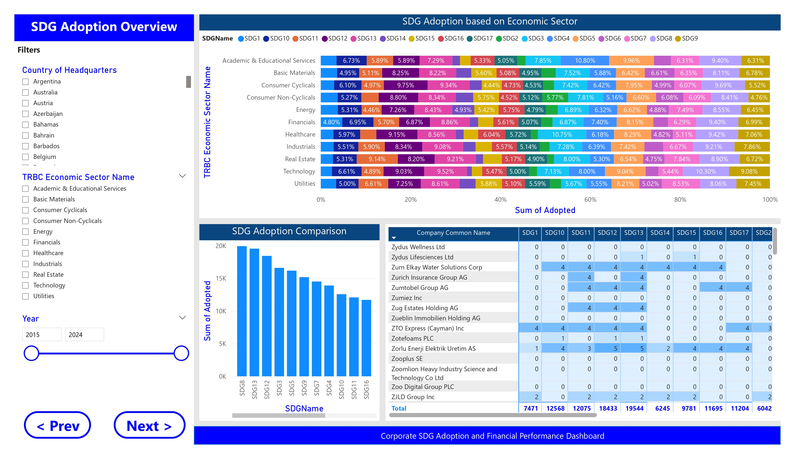
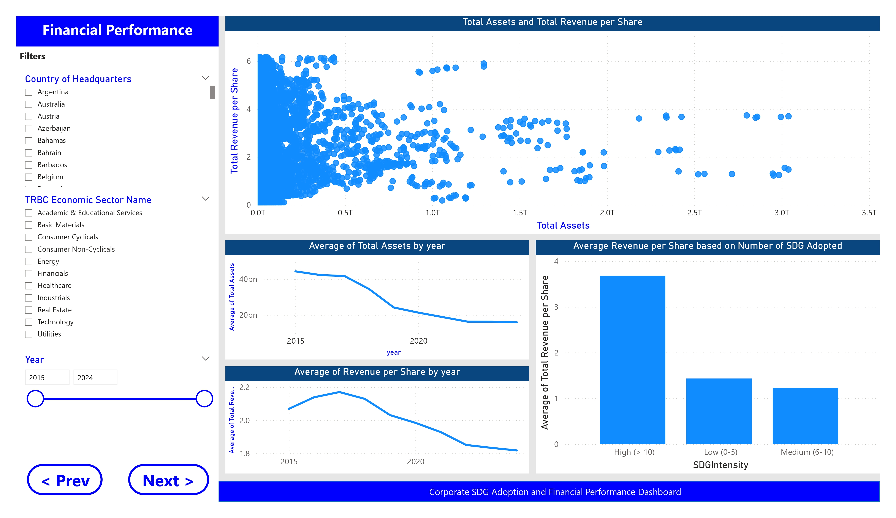
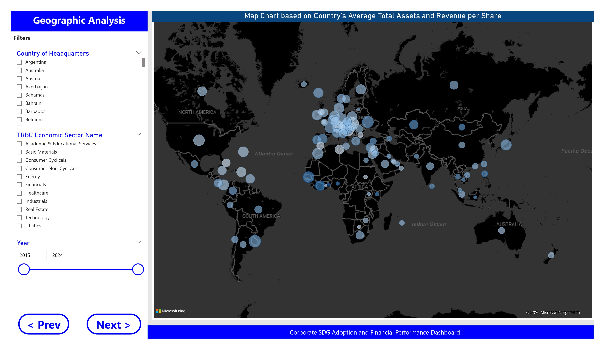
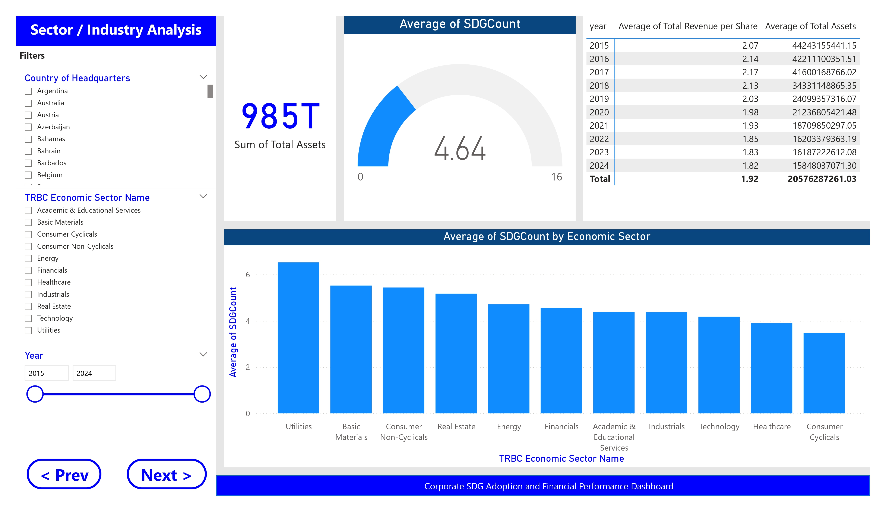

# Power BI Dashboard

This dashboard was developed as part of the project **Corporate Sustainability Analytics: SDG Adoption and Financial Performance Analysis**.

The dashboard consists of four interactive pages that allow users to explore corporate SDG adoption, financial performance, and industry trends.

---

## Dashboard PDF

The complete dashboard can be viewed here:

📄 **[dashboard.pdf](dashboard.pdf)**

---

## Dashboard Pages

### 1. SDG Adoption Overview

Provides an overview of corporate SDG adoption across industries and companies.

---

### 2. Financial Performance

Explores relationships between financial indicators and SDG adoption.

---

### 3. Geographic Analysis

Visualizes company financial metrics across different countries.

---

### 4. Sector / Industry Analysis

Compares SDG adoption and financial indicators across industries.

---

## Notes

The original `.pbix` file is not included because it contains data provided for academic purposes that cannot be redistributed publicly.